# anngg

**A ggplot2-style plotting layer for scanpy `AnnData` objects.**

📖 **[Documentation](https://mdmanurung.github.io/anngg/)** — API reference, quickstart and gallery.

`anngg` gives single-cell users the grammar of graphics over an `AnnData`, the
way `ggplot2` works in R. It is conceptually the same idea as scanpy's
[plotting-with-marsilea](https://scanpy.readthedocs.io/en/stable/how-to/plotting-with-marsilea.html)
how-to — but every figure is written as
`gganndata(adata) + aes(...) + geom_*()` instead of imperative
`sc.pl.*` / marsilea calls.

```python
import scanpy as sc
import anngg as ag
from anngg import gganndata, aes
from plotnine import geom_point

adata = sc.datasets.pbmc68k_reduced()

# grammar of graphics, straight over the AnnData
gganndata(adata, aes("UMAP_1", "UMAP_2", color="louvain")) + geom_point()

# or the high-level, scanpy-equivalent helpers
ag.plot_embedding(adata, basis="umap", color="CD3D")
ag.plot_dotplot(adata, ["CD3D", "NKG7", "CST3"], group_by="bulk_labels")
```

## Gallery

All figures below are produced by `python examples/gallery.py` on
`pbmc68k_reduced`.

| | | |
|:---:|:---:|:---:|
| 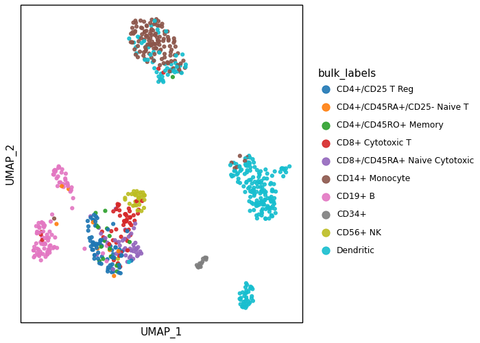 | 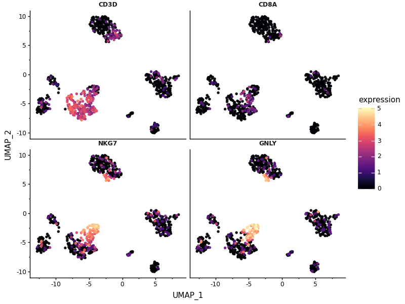 | 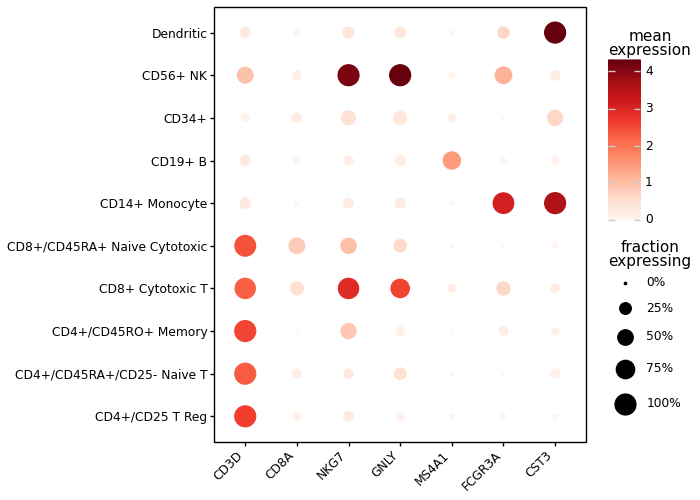 |
| UMAP (stored palette) | `plot_features` grid | `plot_dotplot` |
| 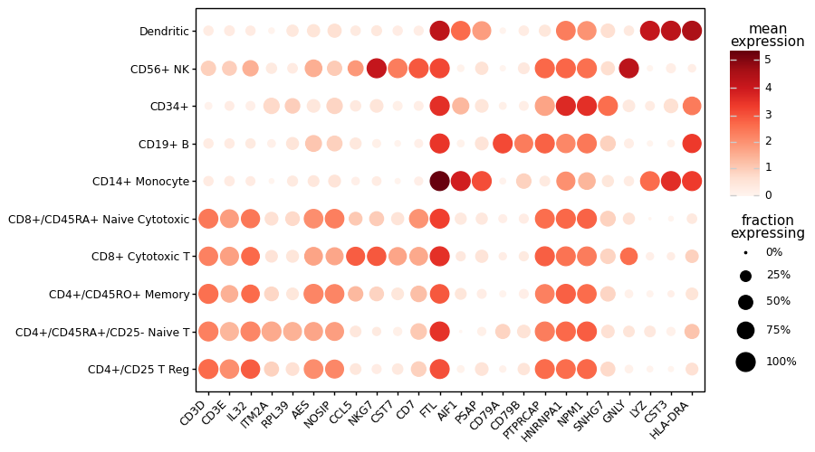 | 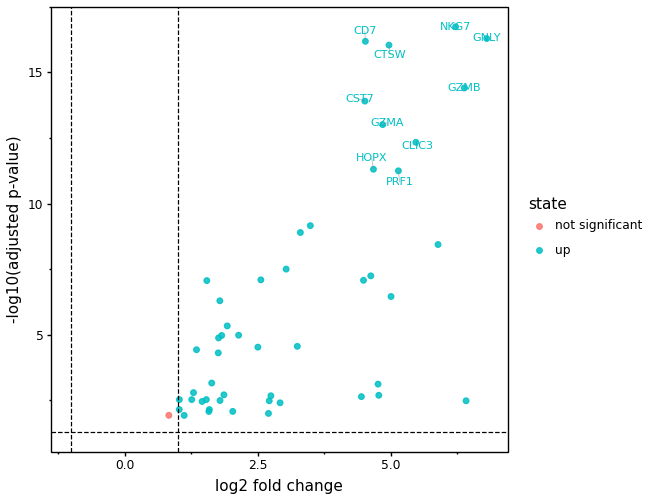 | 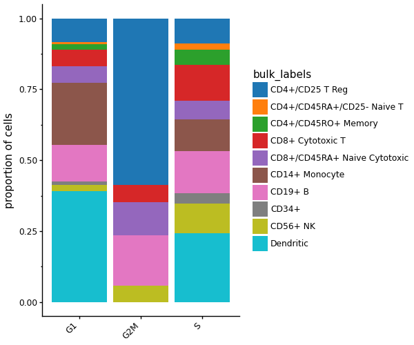 |
| `plot_rank_genes_dotplot` | `plot_volcano` | `plot_proportions` |
| 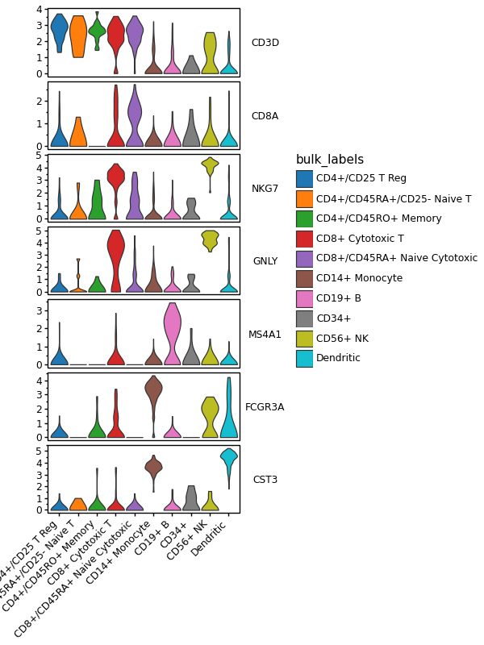 | 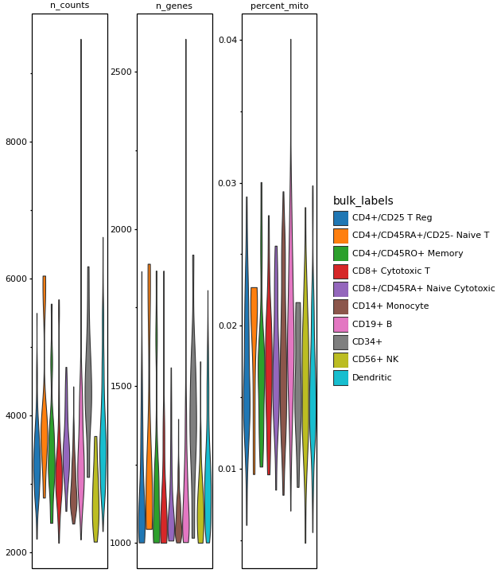 | 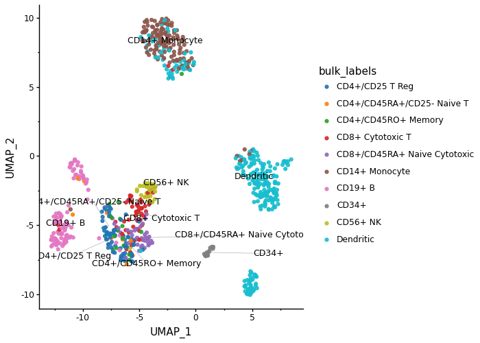 |
| `plot_stacked_violin` | `plot_qc_violin` | `plot_embedding(label=True)` (repelled labels) |
| 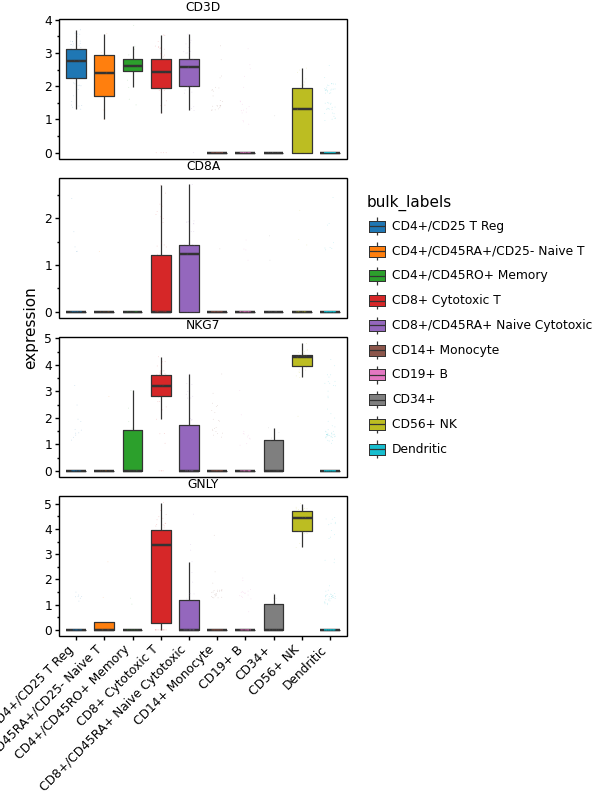 | 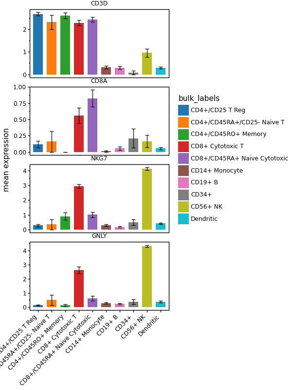 | 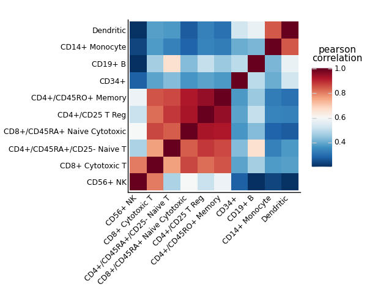 |
| `plot_box` | `plot_expression_bar` | `plot_correlation` |

### Gene-weighted density ([pyNebulosa](https://github.com/mdmanurung/pyNebulosa))

`plot_density` recovers marker signal lost to dropout via weighted kernel density
estimation on the embedding; `joint=True` adds a co-expression panel.

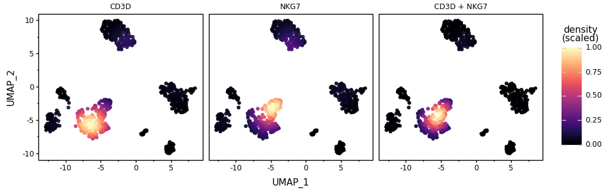

```python
ag.plot_density(adata, ["CD3D", "NKG7"], basis="umap", joint=True)
```

### Set intersections ([marsilea](https://marsilea.readthedocs.io/))

`plot_upset` draws an UpSet plot — e.g. which top marker genes are shared across
cell types (the modern replacement for a Venn diagram).

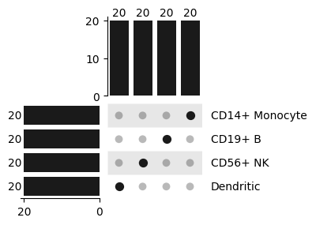

```python
de = ag.rank_genes_df(adata)
sets = {g: list(de[de["group"] == g].head(20)["names"]) for g in cell_types}
ag.plot_upset(sets, min_cardinality=1)
```

Other additions inspired by [scplotter](https://pwwang.github.io/scplotter/) and
[DOTools](https://dotools-py.readthedocs.io/): `plot_box`, `plot_expression_bar`,
`plot_expression_line`, `plot_correlation`, and re-exported `geom_text_repel` /
`geom_label_repel` ([ggrepel](https://github.com/slowkow/ggrepel)-style
non-overlapping labels, via `plotnine-extra`).

`plot_density` (pyNebulosa) and `plot_upset` (marsilea) use optional
dependencies — install them with `pip install anngg[density]` /
`anngg[upset]`.

Every plotnine-native helper is just a stack of grammar layers.
[`examples/grammar_equivalents.py`](examples/grammar_equivalents.py) rebuilds
each one from `gganndata(adata, aes(...)) + geom_* + scale_* + theme` so you can
see there is no magic and drop down to raw grammar whenever you need to.

## Design philosophy

Three ideas, one for each dependency:

1. **The grammar *is* plotnine.** `gganndata(adata)` eagerly resolves the names
   in your `aes()` into a tidy `DataFrame` and returns a real
   [`plotnine.ggplot`](https://plotnine.org). It does **not** subclass `ggplot`
   or reimplement a grammar — so every plotnine geom, stat, scale, facet and
   theme composes with it for free, and
   [`plotnine-extra`](https://github.com/mdmanurung/plotnine-extra)'s single-cell
   helpers (`DimPlot`, `FeatureDimPlot`, `geom_pointdensity`) are reused rather
   than rebuilt.

2. **Data comes only from [`annplyr`](https://github.com/mdmanurung/annplyr).**
   Every plot is extracted through the `adata.ap` accessor
   (`to_df` / `to_tidy` / `summarize`). No helper indexes `adata.X` or
   `adata.obs` directly, so axis alignment is always annplyr's job, and
   aggregations are inspectable `group_by(...).summarize(...)` calls.

3. **[`PyComplexHeatmap`](https://github.com/DingWB/PyComplexHeatmap) is a
   separate escape hatch.** Clustered heatmaps with dendrograms and annotation
   bars are a grid-based paradigm that does not fit the grammar of graphics, so
   `plot_clustermap` lives *outside* the `gganndata() + geom_*` path on purpose.

## Aesthetic resolution

By default a bare name in `aes()` (or a `color=` argument) is **auto-resolved**
in this order:

| Order | Source | Example |
|-------|--------|---------|
| 1 | `adata.obs` column | `"louvain"`, `"bulk_labels"` |
| 2 | gene in `X` / a `layer` / `adata.raw` | `"CD3D"` |
| 3 | embedding coordinate in `obsm` | `"UMAP_1"`, `"PC_1"` |

When a name is **both** an obs column and a gene, obs wins and a warning is
emitted. Embedding coordinates are named Seurat-style: `X_umap` → `UMAP_1`,
`UMAP_2`; `X_pca` → `PC_1`, `PC_2`.

### Strict prefixes (opt-in)

To remove all ambiguity — or to select a specific matrix — prefix the name with
its source. Auto-resolution stays the default; prefixes are only for when you
want to be explicit:

| Prefix | Meaning | Example |
|--------|---------|---------|
| `obs:` | force an `adata.obs` column | `"obs:phase"` |
| `gene:` | force expression (plot-wide source) | `"gene:CD3D"` |
| `gene:…@<layer>` | expression from a specific layer | `"gene:CD3D@logcounts"` |
| `gene:…@raw` / `@X` | expression from `adata.raw` / `adata.X` | `"gene:CD3D@raw"` |
| `obsm:<basis>[i]` | embedding coordinate `i` (0-based) | `"obsm:umap[0]"` |

```python
# fully explicit, and mixing layers per aesthetic in one plot
gganndata(adata, aes(
    x     = "obsm:umap[0]",
    y     = "obsm:umap[1]",
    color = "gene:CD3D@logcounts",   # CD3D from the logcounts layer
    size  = "gene:CD8A@counts",      # CD8A from the counts layer
    shape = "obs:phase",
)) + geom_point()
```

Typed accessors (`gene("CD3D", layer="logcounts")`, `obs("phase")`,
`obsm("umap", 0)`) are also available if you prefer functions over strings; they
resolve identically.

### `use_raw` / `layer`

Matching scanpy, expression defaults to `adata.raw` when it exists (so
`plot_dotplot` reproduces `sc.pl.dotplot`). Override per call — this sets the
matrix for **every** gene in the plot:

```python
ag.plot_dotplot(adata, markers, "bulk_labels", use_raw=False)   # use adata.X
ag.plot_dotplot(adata, markers, "bulk_labels", layer="lognorm") # a named layer
gganndata(adata, aes("UMAP_1","UMAP_2", color="CD3D"), layer="lognorm")
```

To pick the matrix **per gene** (e.g. mixing `counts` and `logcounts` in one
plot), use the `gene:…@<layer>` prefix (or the `gene(..., layer=)` accessor). An
explicit per-gene source overrides the plot-wide default just for that
aesthetic; genes without one inherit it:

```python
gganndata(adata, aes(
    "UMAP_1", "UMAP_2",
    color = "gene:CD3D@logcounts",
    size  = "gene:CD8A@counts",
)) + geom_point()
```

(A given gene name resolves to one column per plot, so to compare the *same*
gene across two layers, extract it twice under different names yourself.)

## API

| Function | Purpose | Returns |
|----------|---------|---------|
| `gganndata(adata, aes(...))` | plotnine-native entrypoint | `plotnine.ggplot` |
| `plot_embedding(adata, basis, color=..., split_by=...)` | UMAP/t-SNE/PCA scatter (density when `color=None`); `split_by` facets it | `plotnine.ggplot` |
| `plot_features(adata, features, basis)` | multi-gene embedding grid (`sc.pl.umap(color=[...])`) | `plotnine.ggplot` |
| `plot_dotplot(adata, genes, group_by)` | size = fraction expressing, colour = mean expression | `plotnine.ggplot` |
| `plot_matrixplot(adata, genes, group_by)` | aggregated mean-expression heatmap (`geom_tile`) | `plotnine.ggplot` |
| `plot_violin(adata, genes, group_by, stats=...)` | per-group distributions, one facet per gene | `plotnine.ggplot` |
| `plot_stacked_violin` / `plot_tracksplot` | compact genes-as-rows marker summaries | `plotnine.ggplot` |
| `plot_dotplot_grouped` / `plot_matrixplot_grouped` | dot/matrix plot with gene-group brackets | `plotnine.ggplot` |
| `plot_rank_genes_dotplot` / `plot_rank_genes_heatmap` | top markers from `rank_genes_groups` | `plotnine.ggplot` |
| `plot_volcano(adata, group)` | volcano from `rank_genes_groups` (reuses `ggvolcano`) | `plotnine.ggplot` |
| `plot_proportions(adata, group_by, split_by=...)` | cell-type composition bars | `plotnine.ggplot` |
| `plot_qc_violin` / `plot_qc_scatter` / `plot_highest_expr_genes` | QC-metric plots | `plotnine.ggplot` |
| `plot_clustermap(adata, genes, group_by=..., annotations=...)` | clustered heatmap (escape hatch) | `ClusterMapPlotter` |
| `theme_anngg()`, `scale_color_expression()`, `scale_color_obs(adata, col)` | theme & scales (incl. scanpy stored palettes) | plotnine objects |
| `Beside` / `Stack` / `Wrap` / `plot_layout` (re-exported) | multi-panel figure composition | plotnine-extra objects |

## Installation

```bash
pip install git+https://github.com/mdmanurung/anngg
# clustered heatmaps (optional):
pip install "anngg[heatmap] @ git+https://github.com/mdmanurung/anngg"
```

`annplyr` is installed from GitHub automatically. `PyComplexHeatmap` is optional
and only needed for `plot_clustermap` (imported lazily).

## Reproducing the marsilea how-to

```bash
python examples/reproduce_marsilea.py   # writes PNGs to examples/_output/
```

## Development

```bash
pip install -e ".[test]"
pytest
```

The test suite verifies, among other things, that `plot_dotplot`'s aggregation
matches `sc.pl.dotplot`'s `dot_color_df` / `dot_size_df` on `pbmc68k_reduced`.

## Non-goals

No forking of plotnine, no spatial / trajectory / interactive backends, and no
leaking of grid-based heatmap concepts into the plotnine API.
