# Helper ↔ grammar

Every plotnine-native `plot_*` helper is a thin wrapper over the plotnine
grammar. This page puts the convenience call next to the layer-by-layer grammar
that reproduces it, with both figures rendered side by side — so you can start
from a helper and drop down to raw grammar the moment you need something it does
not expose.

Each grammar block uses `gganndata(adata, aes(...))` to resolve names into a
tidy `DataFrame` (its `.data`), or `adata.ap.summarize(...)` for grouped
summaries, then stacks ordinary plotnine layers. Every twin below is built and
checked in
[`examples/grammar_equivalents.py`](https://github.com/mdmanurung/ggann/blob/main/examples/grammar_equivalents.py).

```python
import scanpy as sc
import ggann as ag
from ggann import gganndata, aes, gene
from plotnine import *

adata = sc.datasets.pbmc68k_reduced()
group = "bulk_labels"
```

## Embedding

```python
# helper
ag.plot_embedding(adata, "umap", color=group, label=True)

# grammar
coords = ag.embedding_coords(adata, "umap")
x, y = coords.columns[:2]
base = gganndata(adata, aes(x, y, color=group))
cents = base.data.groupby(group, observed=True)[[x, y]].median().reset_index()
(
    base
    + geom_point(size=1.5, alpha=0.9)
    + ag.scale_color_obs(adata, group)
    + guides(color=guide_legend(override_aes={"size": 4}))
    + ag.theme_ggann()
    + geom_label_repel(aes(x, y, label=group), data=cents, fill="white", inherit_aes=False)
)
```

| convenience helper | grammar of graphics |
|:---:|:---:|
| 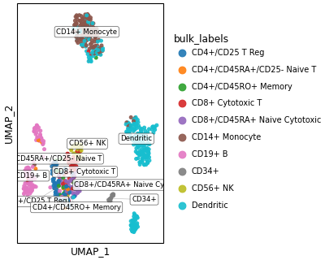 | 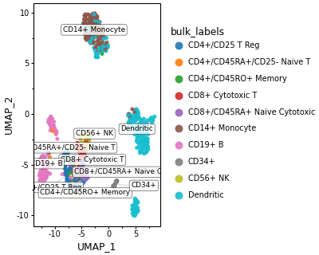 |

## Multi-gene grid

```python
# helper
ag.plot_features(adata, ["CD3D", "NKG7", "CST3", "GNLY"], basis="umap")

# grammar: resolve each gene, melt long, facet
long = ...  # gganndata(...).data per gene, melted to [x, y, feature, expression]
(
    ggplot(long, aes(x, y, color="expression"))
    + geom_point(size=1.2, alpha=0.9)
    + facet_wrap("~feature")
    + scale_color_cmap(cmap_name="magma")
    + ag.theme_ggann()
)
```

| convenience helper | grammar of graphics |
|:---:|:---:|
| 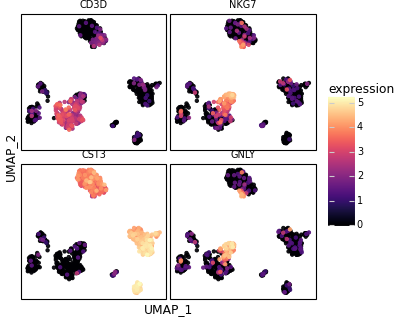 | 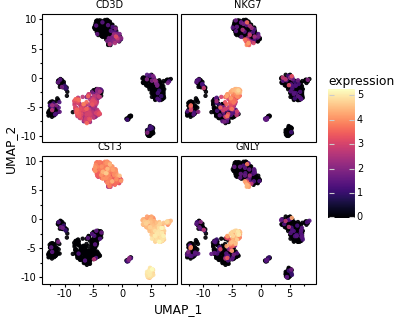 |

## Dotplot

```python
# helper
ag.plot_dotplot(adata, ["CD3D", "NKG7", "CST3", "GNLY"], group)

# grammar: aggregate mean + fraction expressing via annplyr, then size/colour
import annplyr as ap
mean = adata.ap.summarize(raw={g: ap.mean(ap.col(g)) for g in genes}, by=group)
frac = adata.ap.summarize(raw={g: ap.mean(ap.col(g) > 0) for g in genes}, by=group)
long = ...  # merge mean + frac, melt to [group, feature, mean, frac]
(
    ggplot(long, aes("feature", group))
    + geom_point(aes(size="frac", color="mean"))
    + scale_color_cmap(cmap_name="Reds")
    + scale_size(range=(0.5, 8.0), labels=lambda xs: [f"{x:.0%}" for x in xs])
    + ag.theme_ggann()
)
```

| convenience helper | grammar of graphics |
|:---:|:---:|
| 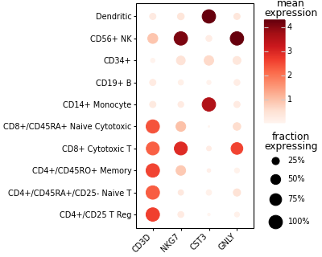 |  |

## Matrixplot

```python
# helper
ag.plot_matrixplot(adata, ["CD3D", "NKG7", "CST3", "GNLY"], group)

# grammar: same group means, drawn as tiles
(
    ggplot(long, aes("feature", group, fill="mean"))
    + geom_tile()
    + scale_fill_cmap(cmap_name="viridis")
    + ag.theme_ggann()
)
```

| convenience helper | grammar of graphics |
|:---:|:---:|
| 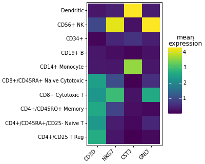 |  |

## Violin

```python
# helper
ag.plot_violin(adata, ["CD3D"], group)

# grammar
d = gganndata(adata, aes(group, gene("CD3D"), fill=group)).data
(
    ggplot(d, aes(group, "CD3D", fill=group))
    + geom_violin(scale="width")
    + ag.scale_fill_obs(adata, group)
    + ag.theme_ggann()
)
```

| convenience helper | grammar of graphics |
|:---:|:---:|
| 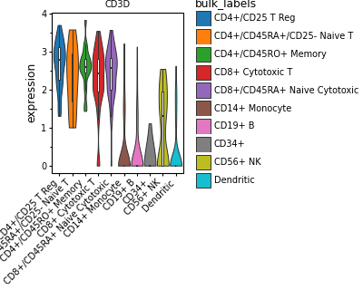 | 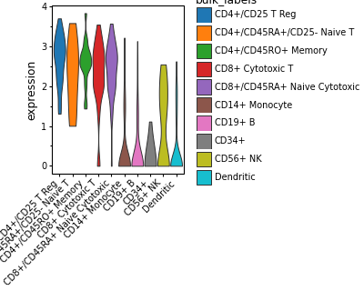 |

## Box

```python
# helper
ag.plot_box(adata, ["CD3D"], group)

# grammar: box + jittered cells
(
    ggplot(d, aes(group, "CD3D", fill=group))
    + geom_boxplot(width=0.7, outlier_alpha=0.0)
    + geom_jitter(width=0.2, size=0.35, alpha=0.25, stroke=0)
    + ag.scale_fill_obs(adata, group)
    + ag.theme_ggann()
)
```

| convenience helper | grammar of graphics |
|:---:|:---:|
| 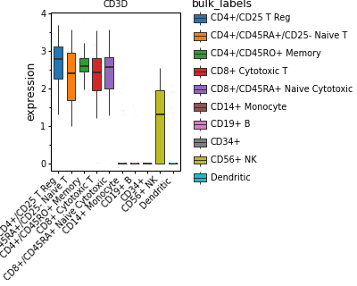 | 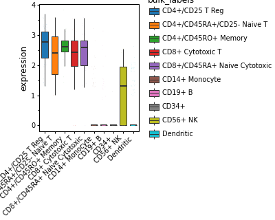 |

## Expression bar (mean ± SE)

```python
# helper
ag.plot_expression_bar(adata, ["CD3D"], group)

# grammar: aggregate mean and standard error, then col + errorbar
d = gganndata(adata, aes(group, gene("CD3D"))).data
s = d.groupby(group, observed=True)["CD3D"].agg(mean="mean", sd="std", n="count").reset_index()
s["se"] = s["sd"] / s["n"] ** 0.5
(
    ggplot(s, aes(group, "mean", fill=group))
    + geom_col(width=0.7)
    + geom_errorbar(aes(ymin="mean - se", ymax="mean + se"), width=0.3)
    + ag.scale_fill_obs(adata, group)
    + ag.theme_ggann()
)
```

| convenience helper | grammar of graphics |
|:---:|:---:|
| 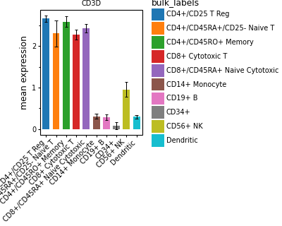 | 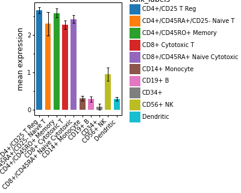 |

## Expression line

```python
# helper
ag.plot_expression_line(adata, ["CD3D"], x="phase", group_by=group)

# grammar: mean expression per (x, group), then line + points
d = gganndata(adata, aes("phase", gene("CD3D"), color=group)).data
s = d.groupby(["phase", group], observed=True)["CD3D"].mean().reset_index(name="mean")
(
    ggplot(s, aes("phase", "mean", color=group, group=group))
    + geom_line()
    + geom_point(size=2)
    + ag.scale_color_obs(adata, group)
    + ag.theme_ggann()
)
```

| convenience helper | grammar of graphics |
|:---:|:---:|
| 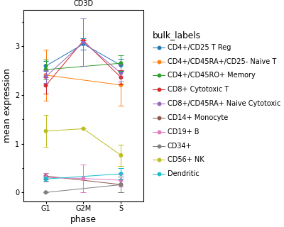 | 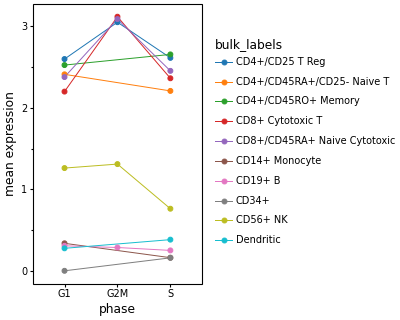 |

## Composition

```python
# helper
ag.plot_proportions(adata, group, split_by="phase", position="fill")

# grammar: count cells per (phase, group), normalise within phase, stack
d = gganndata(adata, aes("phase", fill=group)).data
counts = d.groupby(["phase", group], observed=True).size().reset_index(name="n")
counts["frac"] = counts.groupby("phase", observed=True)["n"].transform(lambda x: x / x.sum())
(
    ggplot(counts, aes("phase", "frac", fill=group))
    + geom_col()
    + ag.scale_fill_obs(adata, group)
    + ag.theme_ggann()
)
```

| convenience helper | grammar of graphics |
|:---:|:---:|
| 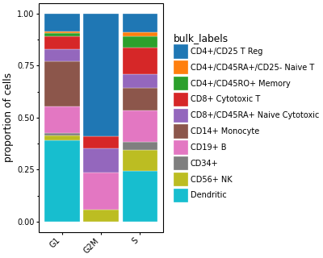 | 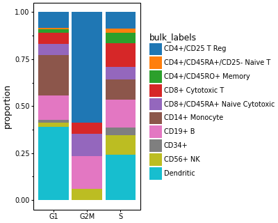 |

## Density (pyNebulosa)

```python
# helper
ag.plot_density(adata, "CD3D", basis="umap")

# grammar: resolve expression, compute the weighted KDE, colour by it
from pynebulosa import calculate_density
d = gganndata(adata, aes(x, y, color=gene("CD3D"))).data
d["density"] = calculate_density(d["CD3D"].to_numpy(float), d[[x, y]].to_numpy(float))
(
    ggplot(d.sort_values("density"), aes(x, y, color="density"))
    + geom_point(size=1.5, alpha=0.9)
    + scale_color_cmap(cmap_name="magma")
    + ag.theme_ggann()
)
```

| convenience helper | grammar of graphics |
|:---:|:---:|
| 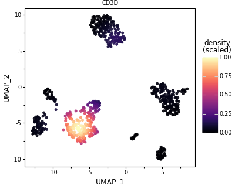 | 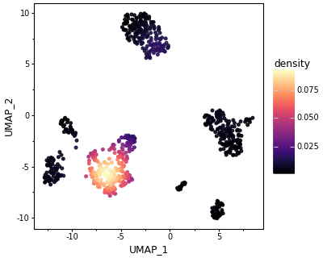 |

## Correlation

```python
# helper (also clusters the axes)
ag.plot_correlation(adata, group)

# grammar: pseudobulk means -> group x group correlation -> tiles
means = adata.ap.summarize(x={g: ap.mean(ap.col(g)) for g in genes}, by=group)
corr = means.set_index(group)[genes].T.corr()
long = corr.rename_axis("row").reset_index().melt(id_vars="row", var_name="col", value_name="corr")
(
    ggplot(long, aes("col", "row", fill="corr"))
    + geom_tile()
    + scale_fill_cmap(cmap_name="RdBu_r")
    + ag.theme_ggann()
)
```

| convenience helper | grammar of graphics |
|:---:|:---:|
| 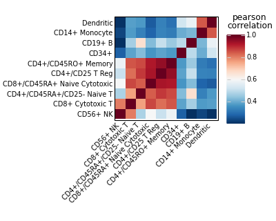 | 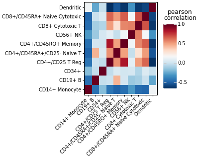 |

```{note}
The helper adds niceties the bare grammar above leaves out — e.g.
`plot_correlation` hierarchically clusters the axes, and several helpers order
groups by the obs categorical order. That is exactly the point: the helpers are
convenience layers over the same grammar you can always write yourself.
```
