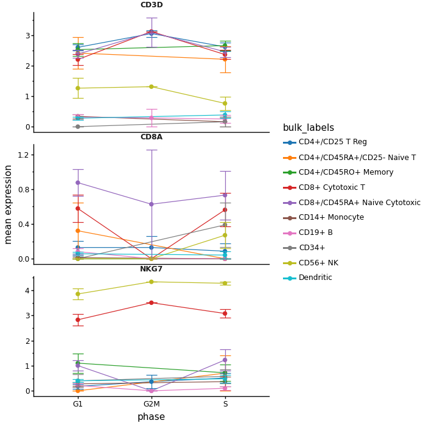

# Gallery

Every figure below is produced by
[`examples/gallery.py`](https://github.com/mdmanurung/anngg/blob/main/examples/gallery.py)
on `pbmc68k_reduced`. The clean, boxed look emulates
[scplotter](https://pwwang.github.io/scplotter/) / plotthis.

## Embeddings

:::{grid} 1 1 2 2

:::

`plot_embedding` — categorical clusters (stored palette) and, with
`label=True`, repelled centroid labels like scplotter's `CellDimPlot`.

`plot_features` — one shared-scale panel per gene.

## Gene-weighted density (pyNebulosa)

`plot_density` recovers marker signal lost to dropout with a weighted KDE;
`joint=True` adds a co-expression panel.

## Markers & expression

:::{grid} 1 1 2 2

:::

`plot_dotplot`, `plot_stacked_violin`, `plot_box`, `plot_expression_bar`.

## Differential expression

:::{grid} 1 1 2 2

:::

`plot_rank_genes_dotplot`, `plot_volcano` (with repelled gene labels).

## Composition, correlation & sets

:::{grid} 1 1 2 2

:::

`plot_proportions`, `plot_correlation`, `plot_upset` (marsilea),
`plot_expression_line`.

## Quality control

`plot_qc_violin`.
