# Reproducing scanpy

ggann reproduces scanpy's core `sc.pl.*` figures on the same `pbmc68k_reduced`
data. Each row shows scanpy's output next to the ggann equivalent (generated by
[`examples/reproduce_scanpy.py`](https://github.com/mdmanurung/ggann/blob/main/examples/reproduce_scanpy.py)).
ggann's are plotnine objects, so they compose with `+ scale_* / + theme(...)`;
scanpy's are matplotlib.

## Side by side

### Embedding — `sc.pl.umap` vs `ag.plot_embedding`
|  scanpy  |  ggann  |
|:---:|:---:|
| 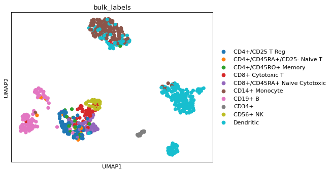 | 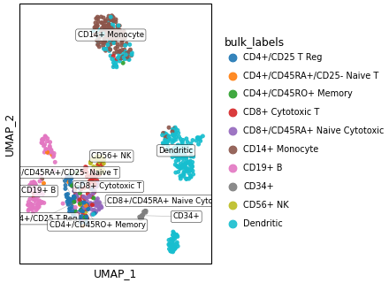 |

### Feature embeddings — `sc.pl.umap(color=genes)` vs `ag.plot_features`
|  scanpy  |  ggann  |
|:---:|:---:|
| 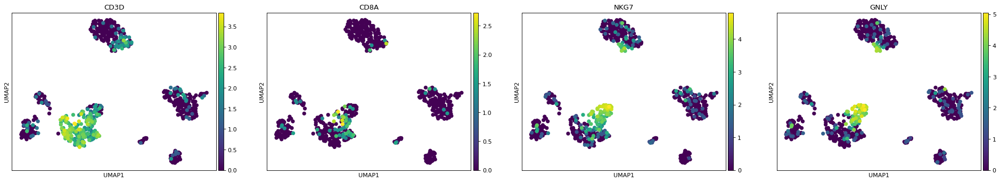 | 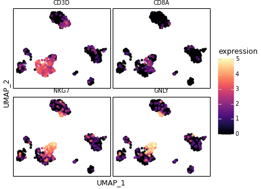 |

### Dotplot / Matrixplot — `sc.pl.dotplot` / `matrixplot`
|  scanpy dotplot |  ggann dotplot | scanpy matrixplot | ggann matrixplot |
|:---:|:---:|:---:|:---:|
| 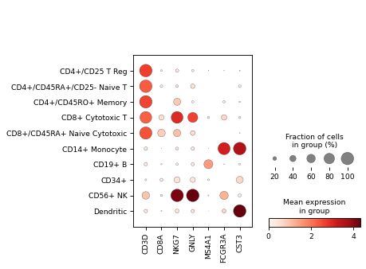 | 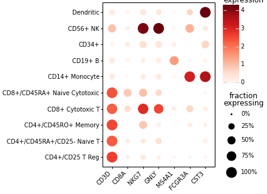 | 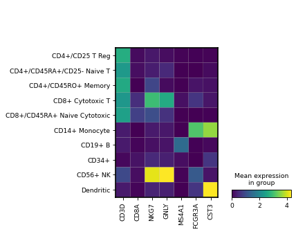 |  |

### Stacked violin / Violin / Tracksplot
|  scanpy stacked_violin |  ggann | scanpy violin | ggann |
|:---:|:---:|:---:|:---:|
| 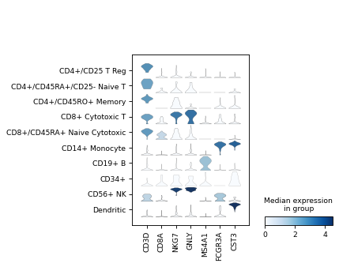 | 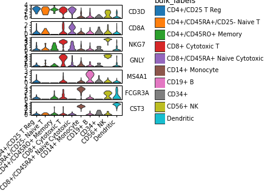 | 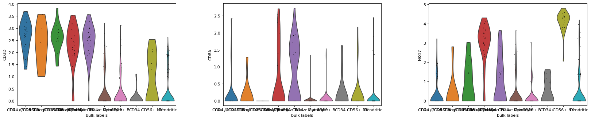 | 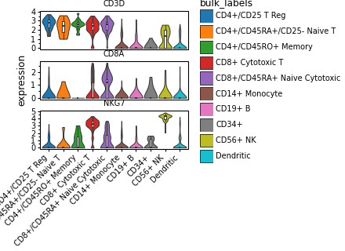 |

|  scanpy tracksplot |  ggann tracksplot |
|:---:|:---:|
| 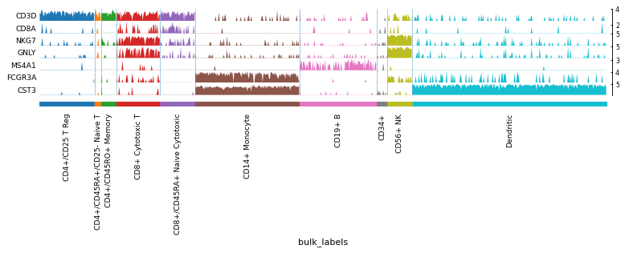 | 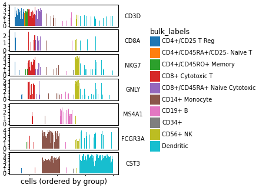 |

### Correlation / Highest-expressed / Marker dotplot
|  scanpy correlation |  ggann | scanpy highest-expr | ggann | scanpy rank-genes | ggann |
|:---:|:---:|:---:|:---:|:---:|:---:|
| 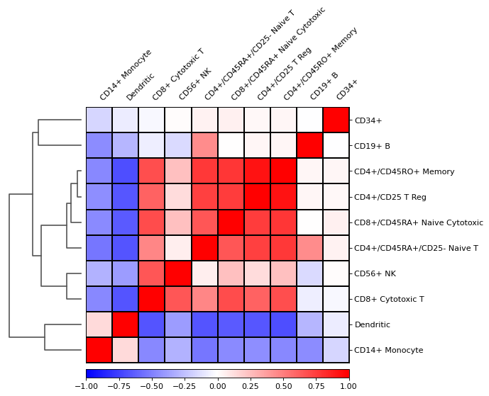 | 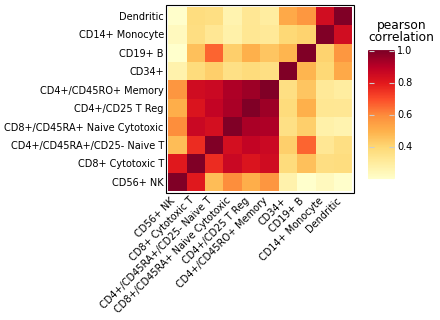 | 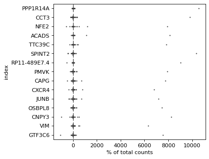 | 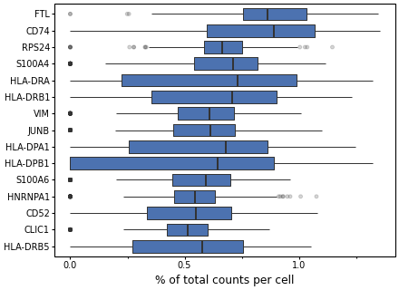 | 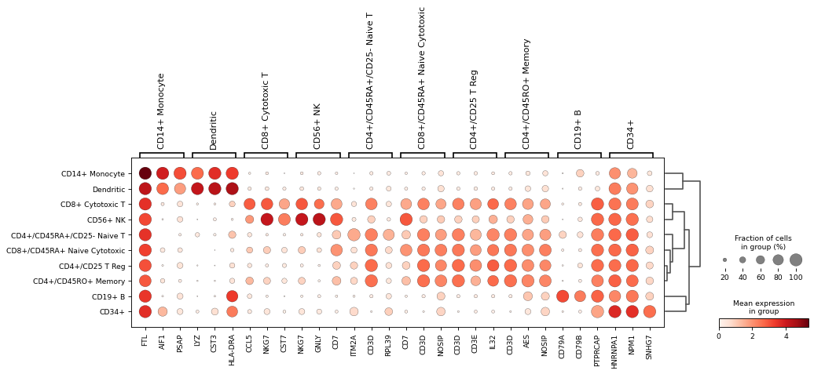 | 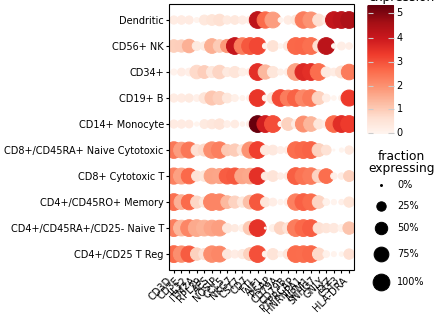 |

## Coverage — every core `sc.pl` figure

| scanpy | ggann | status |
|---|---|---|
| `sc.pl.umap` / `pca` / `tsne` / `embedding` | `plot_embedding(basis=...)` | ✅ |
| `sc.pl.umap(color=[genes])` | `plot_features` | ✅ |
| `sc.pl.dotplot` | `plot_dotplot` | ✅ |
| `sc.pl.matrixplot` | `plot_matrixplot` | ✅ |
| `sc.pl.stacked_violin` | `plot_stacked_violin` | ✅ |
| `sc.pl.violin` | `plot_violin` | ✅ |
| `sc.pl.tracksplot` | `plot_tracksplot` | ✅ |
| `sc.pl.correlation_matrix` | `plot_correlation` | ✅ |
| `sc.pl.highest_expr_genes` | `plot_highest_expr_genes` | ✅ |
| `sc.pl.rank_genes_groups_dotplot/matrixplot` | `plot_rank_genes_dotplot/matrixplot` | ✅ |
| `sc.pl.clustermap` | `plot_clustermap` | ✅ |
| `sc.pl.scatter` (obs metrics) | `plot_qc_scatter` | ✅ |

## Missing plots (the backlog these comparisons surface)

| scanpy | what it is | ggann |
|---|---|---|
| **`sc.pl.heatmap`** | per-**cell** expression heatmap (cells x genes, grouped) | ❌ ggann has only aggregated heatmaps (`plot_matrixplot`, `plot_clustermap`) |
| **`sc.pl.pca_variance_ratio`** | scree / elbow plot for choosing PCs | ❌ (trivial to add: `plot_variance_ratio`) |
| **`sc.pl.embedding_density`** | per-group **cell** density on an embedding | ❌ (`plot_density` is *gene-weighted* KDE — different) |
| **`sc.pl.dendrogram`** | standalone hierarchical tree of groups | ❌ (clustering only happens inside `plot_clustermap`) |
| `sc.pl.scatter` (gene vs gene) | two genes' expression scattered | 🟡 via `gganndata(aes(gene(a), gene(b)))` — no dedicated helper |
| `sc.pl.paga` / `draw_graph` trajectories | graph-abstraction / trajectory | ❌ out of scope (scanpy/scFates) |

Beyond scanpy, common single-cell plots also worth adding: a **sina / beeswarm**
distribution (plotnine-extra ships `stat_sina`), and an **MA plot** for
pseudobulk differential expression.

## A note on performance
ggann trades speed for the grammar-of-graphics: it is typically **~5–10× slower
than scanpy** (plotnine builds a DataFrame + composes layers where scanpy draws
matplotlib directly). It stays sub-second-to-a-few-seconds up to ~200k cells for
most plots; the exception is the violin family, whose cost is plotnine's
`geom_violin` KDE (≈45 s at 200k cells) — subsample cells per group before
plotting large data.
