# Reproducing scplotter

anngg reaches the same figures as [scplotter](https://pwwang.github.io/scplotter/)'s
`CellDimPlot` and `FeatureStatPlot` vignettes — either **directly** through a
helper, or by **composing** one plotnine layer onto a helper (the grammar API).
Below, each distinct chart type is reproduced on `pbmc68k_reduced` (scplotter's
vignettes use a Seurat `pancreas_sub`, so this matches *capabilities*, not
pixels), followed by a full accounting of every vignette example.

Reproductions are generated by
[`examples/reproduce_scplotter.py`](https://github.com/mdmanurung/anngg/blob/main/examples/reproduce_scplotter.py).

## CellDimPlot

| scplotter | anngg |
|---|---|
| `CellDimPlot(group_by=, reduction="UMAP")` | `ag.plot_embedding(adata, "umap", color=group)` |
| `CellDimPlot(..., label=TRUE)` | `ag.plot_embedding(adata, "umap", color=group, label=True)` |
| `CellDimPlot(..., split_by="Phase")` | `ag.plot_embedding(adata, "umap", color=group, split_by="phase")` |
| `FeatureStatPlot(plot_type="dim", features=)` | `ag.plot_embedding(adata, "umap", color="CD3D")` |

|  |  |
|:---:|:---:|
| 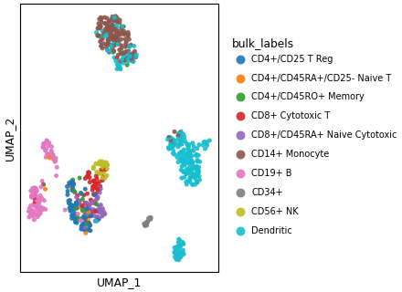 |  |
| 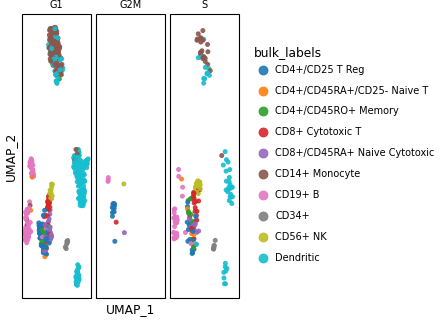 | 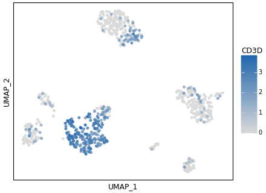 |

**`add_density=TRUE` and `hex=TRUE`** are one composed layer each:

```python
ag.plot_embedding(adata, "umap", color=group) + geom_density_2d(color="black")   # add_density
ggplot(coords, aes(x, y)) + geom_bin2d(bins=28) + scale_fill_cmap("magma")         # hex
```

|  |  |
|:---:|:---:|
|  | 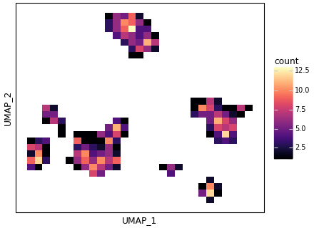 |

### Every CellDimPlot example, accounted for

| Vignette examples | Capability | anngg |
|---|---|---|
| 1–4 | basic UMAP + theme/palette/base_size | ✅ helper (+ `scale_*` / `theme()` compose) |
| 5 | rasterize | 🟡 not a helper flag |
| 6, 7, 22 | highlight a subset | 🟡 compose (colour/subset one group) |
| 7, 8 | `split_by` / `facet_by` | ✅ `split_by=` (or `+ facet_wrap`) |
| 9–12 | centroid labels + label styling | ✅ `label=True` (fg/bg/insitu via `geom_label_repel`) |
| 20–22 | `add_density` contours / filled | ✅ compose `+ geom_density_2d` |
| 27–29 | `hex` binning | ✅ compose `+ geom_bin2d` |
| 13–19 | `add_mark` ellipse/rect/circle | ❌ no `stat_ellipse` in plotnine |
| 23–26 | `stat_by` embedded pie/bar/ring insets | ❌ no scatter-inset geom |
| 30, 31 | kNN / sNN graph edges | ❌ needs a neighbour graph |
| 32–34 | pseudotime lineage curves | ❌ needs lineage fits (slingshot) |
| 35–37 | RNA velocity grid / stream | ❌ scvelo domain |
| 38 | 3D UMAP | ❌ 2D only |

## FeatureStatPlot

| scplotter `plot_type` | anngg |
|---|---|
| `violin` (default) | `ag.plot_violin(adata, genes, ident)` |
| `violin, add_point=TRUE` | `ag.plot_violin(..., add_points=True)` |
| `box` | `ag.plot_box(adata, genes, ident)` |
| `bar` | `ag.plot_expression_bar(adata, genes, ident)` |
| `stack=TRUE` (stacked violin) | `ag.plot_stacked_violin(adata, genes, ident)` |
| `comparisons=TRUE` | `ag.plot_violin(..., stats=True)` |
| `heatmap` | `ag.plot_matrixplot(adata, genes, ident)` |
| `dot` | `ag.plot_dotplot(adata, genes, ident)` |
| `cor` | `ag.plot_correlation(adata, ident, genes=)` |

|  |  |
|:---:|:---:|
| 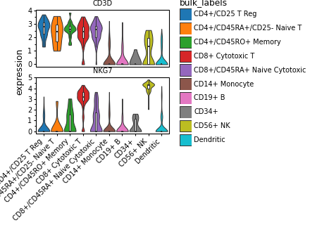 | 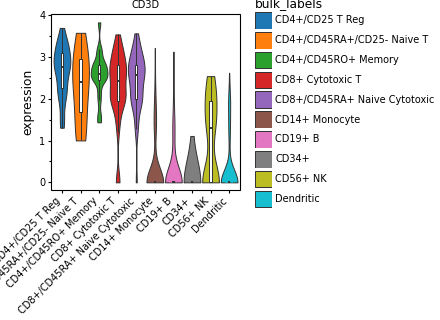 |
| 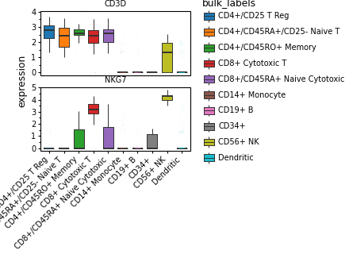 | 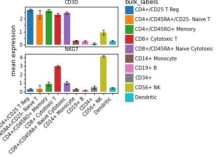 |
|  | 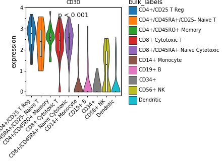 |
| 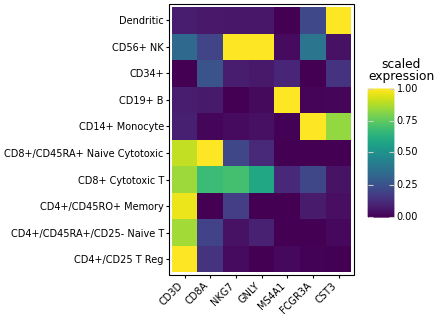 |  |
| 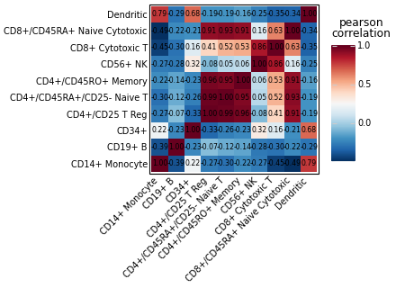 | 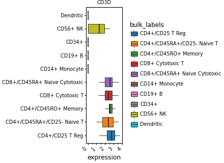 |

`add_stat=mean` and `flip=TRUE` are one composed layer each
(`+ stat_summary(fun_y=np.mean, geom="point")`, `+ coord_flip()`).

### Every FeatureStatPlot example, accounted for

| Vignette examples | Capability | anngg |
|---|---|---|
| 1–3 | violin / box / bar | ✅ `plot_violin` / `plot_box` / `plot_expression_bar` |
| 5 | `add_point` | ✅ `add_points=True` |
| 9 | `comparisons` (stats) | ✅ `stats=True` |
| 10–13 | stacked violin/box (+ flip) | ✅ `plot_stacked_violin` (+ `coord_flip`) |
| 14 | `split_by` per gene | ✅ per-feature facets |
| 15–20, 29, 33 | `plot_type="dim"` feature UMAP (+ theme/split/highlight) | ✅ `plot_embedding(color=gene)` / `plot_features` |
| 35, 36, 44 | `plot_type="heatmap"` | ✅ `plot_matrixplot` |
| 43 | `plot_type="dot"` | ✅ `plot_dotplot` |
| 45 | `plot_type="cor"` | ✅ `plot_correlation` |
| 6, 7 | `add_trend` / `add_stat` | 🟡 compose (`+ geom_line` / `+ stat_summary`) |
| 8 | `group_by` stratify (dodge) | 🟡 compose (grammar) |
| 21–24 | dim + density / hex | 🟡 compose (as for CellDimPlot) |
| 30–32 | dim quantile / cutoff colour scaling | 🟡 compose (`+ scale_*`) |
| 37–42 | annotated heatmap: bars/dot/violin cells, pie/violin annotations | 🟡 `plot_clustermap` (PyComplexHeatmap) covers most |
| 4 | `ridge` | ❌ no ridgeline geom |
| 25–27 | dim + pseudotime lineages | ❌ needs lineage fits |
| 46 | `cor` pairs matrix | ❌ no pairs geom |

## Summary
Every **general scRNA-seq** chart type in both vignettes is reproducible in anngg
— directly for the common ones, and with a single composed layer for the rest.
The only true gaps are `ridge`, the `cor` pairs matrix, ellipse `add_mark`, and
the capabilities that need data anngg does not model (velocity, pseudotime
lineages, kNN-graph edges, scatter-inset stats, 3D) — each of which lives in a
dedicated Python tool (scvelo, slingshot-likes, squidpy).
